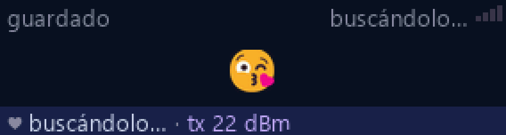
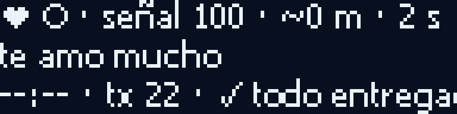

# LoRa Messenger: offline chat and photos with ESP32-S3, ESP32-C3 and a PC

**English** · [Español](README.es.md)

By [Francisco Aldunate](https://franciscoaldunate.cl) · Talca, Chile · October 2026

I built this so my partner and I can talk over ~10 km **with no internet and no cell signal**. It's meant for emergencies: if the network goes down, we can still text, send photos and know whether the other one is in range.

- **Her device** is sealed against water. It connects to her phone over Wi-Fi, and any browser opens the chat.
- **On my side** there's a pocket ESP32-C3, or a PC with a LoRa module on USB.

All the code is here, so nobody who wants something similar has to start from scratch.

| | | |
|---|---|---|
|  |  |  |
| Message received on the S3 screen | A photo arrived (with thumbnail) | Status: time since last heard, distance and power |
|  |  |  |
| Emoji | Message sent from the PC | The pocket C3 (128×32 OLED): signal 0–100, last message, "all delivered" |

## What it does

- **Two-way chat and photos** over LoRa, no internet. Photos come in 3 qualities and are shrunk and sent in chunks.
- **The same web page on all three devices.** The S3 and C3 serve it from their own Wi-Fi network (captive portal); the PC opens it in its own window. Any phone works, nothing to install.
- **"In range" indicator.** For example "💙 nearby · ~1.5 km · heard 20 s ago" or "no signal since 14:32". It alerts and vibrates when the other device is back in range.
- **Nothing gets lost.** Undelivered messages are retried forever, but only while in contact. Anything written without signal goes out on its own as soon as signal returns.
- **Nothing is duplicated.** Every message carries its own number and the time it was written. A message that arrives again days later, after a lost ack, is recognized.
- **Nothing is ambiguous.** ✓✓ = delivered · 👀 = read. Read receipts are retried too.
- **Interrupted photos resume.** Received chunks are kept for 24 h; when signal returns, only the missing part is sent.
- **You can chat during a photo transfer.** Messages are interleaved between chunks.
- **Bursts.** Several queued messages go out together in one packet with a single ack.
- **Remote control.** Each device can change the other's settings and set its clock over the radio.
- **Built to be sealed.** It has:
  - Wi-Fi OTA with rollback;
  - a watchdog that reboots if the radio hangs for 20 s;
  - atomic message history on LittleFS.

## Hardware

| Part | Fixed device (sealed) | Pocket device | PC station |
|---|---|---|---|
| MCU | ESP32-S3 N16R8 (16 MB flash, 8 MB PSRAM) | ESP32-C3 SuperMini | — (Python) |
| Radio | DX-LR32-900T22D (SX1262, 22 dBm) over **USB host** (CH340) | DX-LR32 soldered to UART (TX→GPIO7, RX←GPIO6, AUX→5, M0→3, M1→4, VCC→5V) | DX-LR32 + DX-PJ15 USB adapter |
| Display | ST7789 color | SSD1306 128×32 OLED (SDA→8, SCK→9) | window with the same page |
| Notes | OTG jumper soldered; **470 µF capacitor across 5V/GND**: without it, the S3 hung on ~20 % of transmissions at 22 dBm | Pins 2, 20, 21 left free on purpose | Starts with Windows |

⚠️ With the OTG jumper soldered, the S3's "USB" port **outputs** 5 V: never plug it into a PC or charger.

## Lessons measured the hard way

- **The DX-LR32 holds back packets of 31, 63, 95… bytes** (length % 32 == 31) until another one arrives. A 20-letter message was exactly 31 bytes. Fix: prepend a 0x00 byte (`lora.c`, `radio_pc.py`).
- **Collisions.**
  - When both talk at once, neither hears; retrying with the same delay collides again.
  - You need a growing random backoff longer than the airtime.
  - Never use clock-based turns: with drifting clocks they collide forever.
- **A 13-byte heartbeat takes 0.725 s on air** at the longest-range level (SF11/125 kHz).
  - Searching more often than every ~3 s makes reconnection worse.
  - In simulation, the best was every ~4 s with ±50 % jitter (`herramientas/simular_encuentro.py`).
- **Wait for AUX low before writing to the module.** Writing while it was receiving dropped a byte.
- **Saving the full history blocks the radio for seconds,** so it runs in a separate task. With both sides flooding messages, delivery averages ~6–7 s instead of minutes (`herramientas/prueba_turnos2.py`).
- **The web page sends fields urlencoded.** Decode before saving, or the Wi-Fi name becomes `Mensajes%20%F0…`.
- **"Interrupt WDT" when transmitting at 22 dBm** with the display attached. Fixed with:
  - `CONFIG_ESP_INT_WDT_TIMEOUT_MS=3000`;
  - Wi-Fi at 8.5 dBm;
  - dimming the display while transmitting.
- **18,431 AT commands swept.** Nothing hidden: LEVEL0 + 22 dBm is the LR32's ceiling, and `AT+KEY` is a fixed scramble, not encryption.

## How to use it

1. Install [ESP-IDF](https://docs.espressif.com/projects/esp-idf/) v6.x.
2. Copy `secreto.example.json` to `secreto.json` and set your own keys (each device's Wi-Fi and the module key).
3. Generate the `secreto.h` files (never committed):
   ```
   python herramientas/generar_secreto_s3.py
   python herramientas/generar_secreto_c3.py
   ```
4. Build and flash:
   ```
   cd firmware-s3 && idf.py build && idf.py -p COMx flash
   cd firmware-c3 && idf.py build && idf.py -p COMy flash
   ```
5. On the PC (optional): `python servidor_pc.py` opens the same page and drives a USB LoRa module. Don't run the C3 and the PC at the same time: both would be the same person.

## Test tools (`herramientas/`)

- `simular_v2.py`: two radios in a virtual air with loss, half-duplex collisions, dropouts and levels; ×40 time, 12 scenarios.
- `banco_v2.py`: 20 real hardware tests with injected faults: out of range, dropped acks, reboot mid-photo.
- `prueba_turnos2.py`: measures delivery while both sides send at once.
- `simular_encuentro.py`: reconnection time vs. search interval.
- `esfuerzo_tx.py`, `prueba_potencia.py`: hangs and power draw at 22 dBm.
- `s3.py`: S3 USB console (status, message list, log of the last 48 packets).

The code and comments are in Spanish.

## Status

In daily use between the two devices and the PC. Two things are still to be measured:
- full battery life of both devices;
- reconnection while actually walking apart.

Until then, don't market it as a certified emergency device.

## Author

**Francisco Aldunate Rodríguez** · Talca, Chile · ESP32 firmware (P4, S3, C3)
Portfolio: **[franciscoaldunate.cl](https://franciscoaldunate.cl)** · GitHub: [@franciscoaldun](https://github.com/franciscoaldun)

## License

[MIT](LICENSE). Check your country's rules for the 900 MHz band and transmit power (the Americas use 915 MHz).
